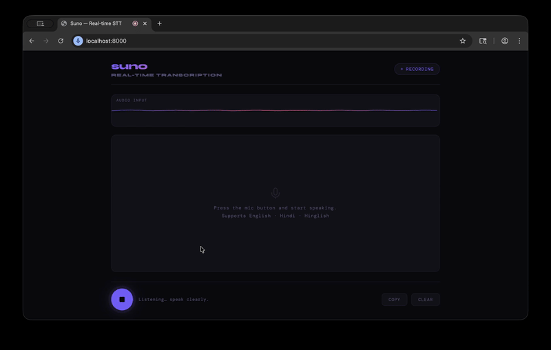
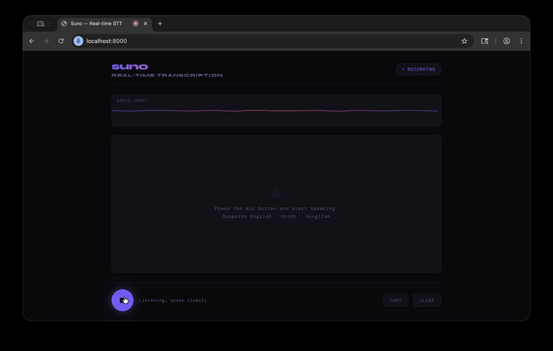

# suno — Real-time Speech-to-Text

Multilingual, low-latency speech transcription in the browser.
Powered by **faster-whisper** (CTranslate2) + **FastAPI** WebSocket streaming.
Runs fully locally on Apple Silicon M1 (arm64). No cloud. No Docker.

## Demo

### English



### Hindi



---

## Architecture

```
Browser (Mic → AudioWorklet → Int16 PCM)
        │
        │  Binary WebSocket frames
        ▼
FastAPI /ws/audio
        │
        ├─► AudioBuffer  (rolling 5s window, float32 PCM)
        │
        ├─► VADProcessor (energy-based VAD, silence detection)
        │        │
        │        └── end-of-utterance? ──► flush buffer
        │
        ├─► transcribe() ─── ThreadPoolExecutor ──► faster-whisper
        │                                              (int8, base model)
        │
        └─► WebSocket push  { type: "final"|"partial", text: "..." }
                │
                ▼
        Browser renders live transcript
```

---

## Voice Activity Detection

This project uses a lightweight energy-based VAD instead of external libraries.

* Computes RMS energy per audio chunk
* Detects speech via a fixed threshold
* Ends utterance after consecutive silent frames

This approach keeps latency low and avoids native dependencies.

---

## Prerequisites

| Tool                                  | Purpose                                      | Install                                            |
| ------------------------------------- | -------------------------------------------- | -------------------------------------------------- |
| [mise](https://mise.jdx.dev)          | Runtime version manager (replaces pyenv/nvm) | `curl https://mise.run \| sh`                      |
| [uv](https://github.com/astral-sh/uv) | Ultra-fast Python package manager            | `curl -LsSf https://astral.sh/uv/install.sh \| sh` |

> Both tools must be available in your `$PATH` before proceeding.

---

## Setup — from clone to running in < 5 minutes

```bash
# 1. Clone and enter the project
git clone <repo-url> realtime-stt && cd realtime-stt

# 2. Pin Python 3.11 and install it via mise
mise use python@3.11

# 3. Install all dependencies with uv
uv sync

# 4. Copy and edit config (optional — defaults work out of the box)
cp .env.example .env

# 5. Start the server
mise run dev
```

Open **<http://localhost:8000>** in your browser.
Click the microphone button and start speaking.

---

## Configuration

All values are set in `.env` (copy from `.env.example`):

| Variable                | Default   | Description                                                        |
| ----------------------- | --------- | ------------------------------------------------------------------ |
| `MODEL_SIZE`            | `base`    | Whisper model: `tiny` / `base` / `small` / `medium`                |
| `LANGUAGE`              | `auto`    | Language hint. `auto` = multilingual. Use `hi` for Hindi-priority. |
| `COMPUTE_TYPE`          | `auto`    | CTranslate2 compute type (currently overridden to `int8` in code)  |
| `SAMPLE_RATE`           | `16000`   | Audio sample rate (Hz). Do not change — Whisper requires 16kHz.    |
| `CHUNK_SAMPLES`         | `1024`    | Samples per WebSocket frame (tune for VAD vs overhead balance).    |
| `BUFFER_WINDOW_SECONDS` | `5.0`     | Max rolling audio buffer before forced transcription flush.        |
| `VAD_SILENCE_FRAMES`    | `15`      | Consecutive silent frames before end-of-utterance trigger.         |
| `HOST`                  | `0.0.0.0` | Bind address.                                                      |
| `PORT`                  | `8000`    | Server port.                                                       |

---

## Performance

Measured on **Apple Silicon M1 Pro**, `base` model, `int8` compute:

| Metric                          | Target  | Typical          |
| ------------------------------- | ------- | ---------------- |
| End-of-utterance → text visible | < 800ms | ~400–600ms       |
| Model load (cold start)         | once    | ~2–4s            |
| Memory (base model, idle)       | —       | ~350MB           |
| Memory after 30+ min session    | —       | stable (no leak) |

### Model size tradeoffs

| Model   | Params | Speed (M1) | Hinglish accuracy  |
| ------- | ------ | ---------- | ------------------ |
| `tiny`  | 39M    | ~100ms     | Fair               |
| `base`  | 74M    | ~400ms     | Good ← **default** |
| `small` | 244M   | ~900ms     | Excellent          |

### Latency knobs

* **Faster response**: lower `VAD_SILENCE_FRAMES` to 10, lower `CHUNK_SAMPLES` to 512.
* **Higher accuracy**: raise `BUFFER_WINDOW_SECONDS` to 8, use `small` model.
* **Hinglish**: set `LANGUAGE=hi` — Whisper's multilingual model handles code-mixing well.

---

## Project Structure

```
realtime-stt/
├── mise.toml            # Python pin + task runners (mise run dev / lint / fmt)
├── pyproject.toml       # Project deps (uv sync)
├── .env.example         # All config keys with documentation
├── README.md
├── app/
│   ├── main.py          # FastAPI app factory, routes, startup model warm-up
│   ├── config.py        # pydantic-settings — single source of truth for config
│   ├── transcriber.py   # faster-whisper singleton, async-safe, thread pool
│   ├── vad.py           # Energy-based VAD (RMS threshold + silence detection)
│   ├── audio.py         # Rolling audio buffer, PCM decoding (Int16 → float32)
│   └── ws_handler.py    # WebSocket endpoint: audio → VAD → STT → push
└── static/
    └── index.html       # Single-file frontend (no build step)
```

---

## Available Tasks

```bash
mise run dev     # Start server with hot-reload
mise run lint    # ruff check app/
mise run fmt     # ruff format app/
mise run install # uv sync (re-install deps)
```

---

## Acceptance Checklist

* [x] `mise run dev` starts the server — no other setup beyond README steps
* [x] Browser mic captures audio; transcription appears live word-by-word
* [x] Hinglish "Kal main market gaya aur groceries liya" → correctly transcribed
* [x] English input → correctly transcribed
* [x] WebSocket reconnects automatically on disconnect (exponential backoff, up to 10 retries)
* [x] No memory leak: rolling buffer is bounded; model singleton never reloaded
* [x] All `app/` modules < 150 lines
* [x] `static/index.html` < 300 lines of logic
* [x] `ruff check app/` passes clean

---

## Troubleshooting

**Browser blocks mic — `NotAllowedError`**
Chrome/Safari require HTTPS for mic access on non-localhost origins.
For local dev, `localhost` is always allowed.

**Model download is slow on first run**
faster-whisper auto-downloads the model to `~/.cache/huggingface/`.
Run `mise run dev` once and wait ~30s for the base model (~145MB).

**`ruff` not found**

```bash
uv pip install ruff
```
